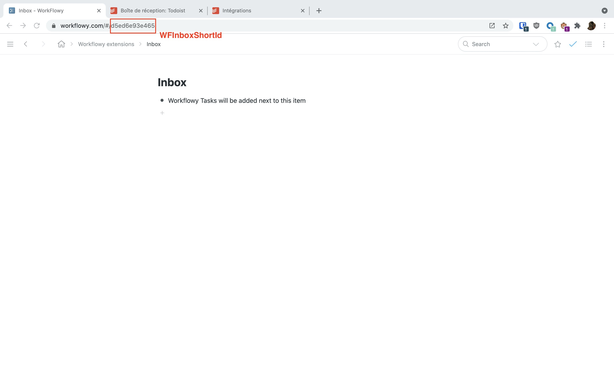
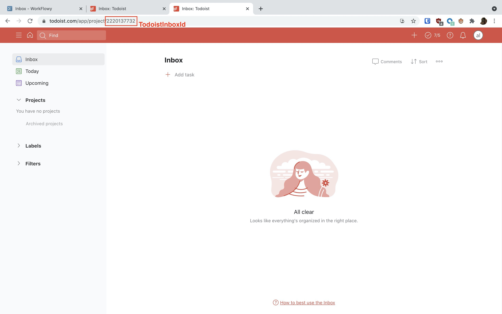
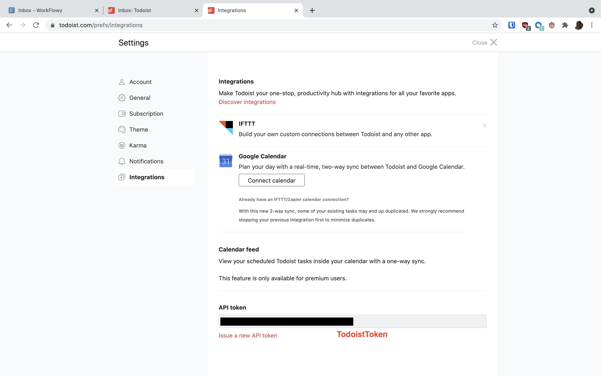

# Todoist to Workflowy Bookmarklet

This bookmarlet allows you to capture all tasks from your Todoist inbox into a specific workflowy node with a single click.

## Installation Guide

1. Get the required parameters
    1. **WFInboxShortId** (required)
       
    1. **TodoistInboxId** (required)
       
    1. **TodoistToken** (required)
       
    1. Set **CompleteOnPull** to true if you want your tasks to be completed after beeing imported to Workflowy

1. Fill the first paragraph of [the js script](todoist_to_wf.js) using these parameters. Ex:
    ```javascript
    settings = {
        WFInboxShortId: "d5ed6e93e465",
        TodoistInboxId: "2220137732",
        TodoistToken: "<your-todoist-token>",
        CompleteOnPull: true,
    };
    ```

1. Use [this website](https://caiorss.github.io/bookmarklet-maker/) to convert the script to a bookmarklet
    1. Usage: Paste a code into the form and click on the button generate.
    1. To install the bookmarklet drag and drop it to the bookmars toolbar.
